# Chitragupta — the XBatch Helpdesk

Chitragupta is a three-level support system for the XBatch / XStudio plant software at Jindal Shadeed.

- **L1: a chat helpdesk for plant users.** Someone describes a problem. The system either answers from the XBatch process knowledge, asks for the missing detail, or raises a ticket.
- **L2: an autonomous support engineer.** It claims each ticket, reads the live XBatch database through an audited read-only tool surface, decides what the evidence means, and publishes a reply back to the ticket.
- **L3: a desk for people.** When the fix needs a human or the cause is out of L2's reach, the ticket lands here with the evidence already gathered.

XStudio's Helpdesk (`Complaint_Mst_Tbl`) stays the ticket system of record. TypeSafe **Jev** makes the fast typed judgments (route, relevance, verdict, review). A local model (Qwen on LM Studio) writes only when the evidence needs reasoning. Deterministic code owns every lifecycle transition, capacity limit and publication.

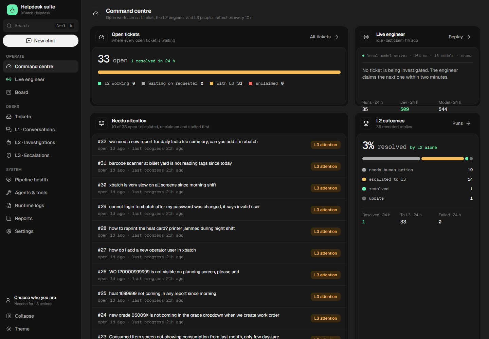

---

## Contents

1. [How a problem travels](#how-a-problem-travels)
2. [The screens](#the-screens)
3. [Architecture](#architecture)
4. [The L2 pipeline](#the-l2-pipeline)
5. [Knowledge](#knowledge)
6. [The L1 API](#the-l1-api)
7. [Running it](#running-it)
8. [Operating it](#operating-it)
9. [Repository map](#repository-map)
10. [Design system](#design-system)
11. [Change discipline](#change-discipline)

---

## How a problem travels

```text
 Plant user                        L1  ·  .NET API + Next.js helpdesk
 "GR not happening for heat 1603945"
        │
        ▼
 ┌─────────────────────────────────────────────────────────────────────────┐
 │ Jev decides the turn:  answer │ ask for details │ raise a ticket          │
 │ GBrain searches the XBatch world; Jev keeps only relevant pages         │
 │ the configured writer model phrases the reply (it never decides)        │
 └───────────────┬─────────────────────────────────────────────────────────┘
                 │ ticket row in Complaint_Mst_Tbl (+ link to the chat)
                 ▼
 L2  ·  Hermes + Jev + deterministic runtime (WSL)
   ticket_scout (every 2 min) claims it atomically, within pipeline capacity
   Jev gates: triage, safety, does known knowledge apply
   world_walk: audited live reads of the tables the ticket's identifiers touch
   Jev judges each record (cause / stuck / requester view / unrelated)
   harness builds a fact table ─► Jev direct_answer picks the outcome
       most tickets finish here with a fixed, evidence-backed reply (no model)
       NEEDS_REASONING only ─► local model composes / investigates (one slot)
   frozen proposal ─► Jev primary review ─► publish / rework (≤3) / escalate
                 │
                 ├─ RESOLUTION / UPDATE / QUESTION ─► reply on the ticket, requester sees it in L1
                 └─ NEEDS_HUMAN_ACTION / L3_ESCALATION ─► L3 queue with findings
                                                           │
 L3  ·  people in the support console                     ▼
   pick up, add notes, resolve (optionally close the ticket and tell the requester)
```

Every step is recorded (run row, SQL action audit, trace events, Jev decisions), and the console replays any run step by step from those records.

---

## The screens

There are two surfaces on one Next.js app (`l1-ui`, port 3417). Both share one design system.

### Requester helpdesk: `/`

The page plant users open, usually embedded in XStudio as `/?user={XStudioUserID}`.

| Home | Chat |
|---|---|
| 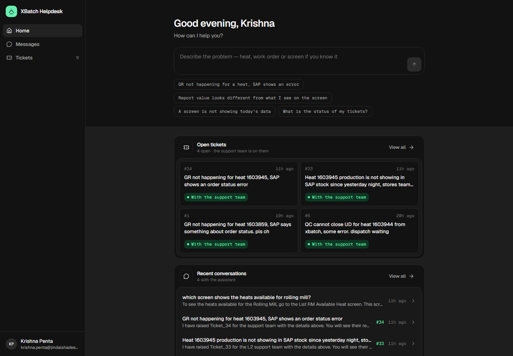 | 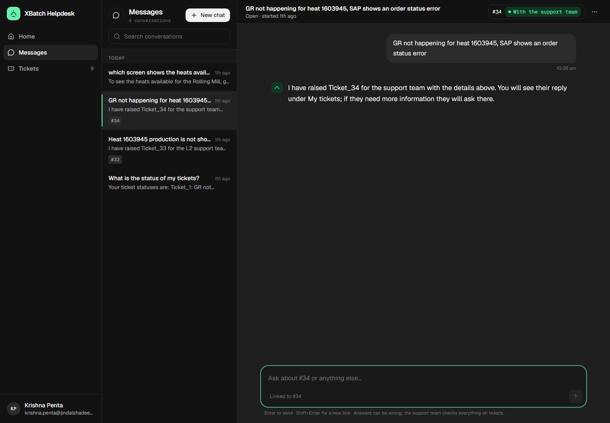 |

- **Home:** start a conversation, see tickets waiting on you, open tickets and recent chats.
- **Messages:** streaming replies, with the XBatch pages each answer used, thumbs up or down, "Talk to support" to hand over, and a link to the ticket the chat raised.
- **Tickets:** full timeline of each ticket (support replies, your answers), reply to questions, rate a resolution, and report "still not fixed".
- Works as a narrow widget with bottom tabs on phones:

<p align="center">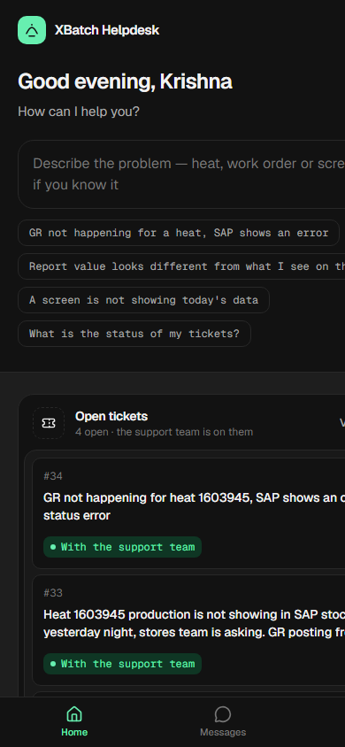</p>

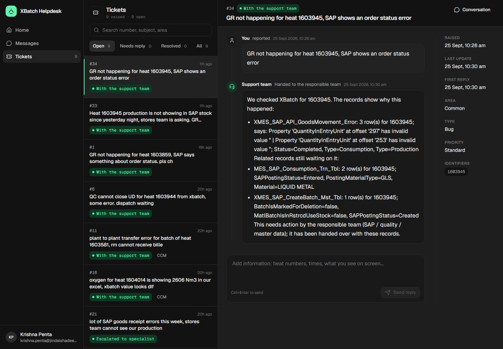

### Support console: `/admin`

One sidebar, grouped by what the desk does. **New chat** (top of the nav, or Ctrl+K) starts a chat inside the console as the acting engineer. **Ctrl+K** also searches tickets and pages.

#### Command centre
Open tickets by who owns them (L2 working, waiting on requester, with L3, unclaimed). Tickets needing attention, most urgent first. The live engineer card, with the last health check of the local model server. L2's outcome mix and a lane-coded activity feed. *(Screenshot at the top.)*

#### Live engineer
Each investigation drawn as the circuit it ran through: **ticket → Jev gates → audited probes → evidence → Jev verdict → local model → outcome**. Each connector carries the fact that crossed it (identifier, route, how many records were flagged, verdict confidence).

- Every probed record is one square. Squares turn a colour once Jev judges them.
- **Follow live** attaches to the run being worked now. **Replay** steps through a finished run event by event.
- The work trace below is a waterfall of every Jev decision, walk step, tool call and model call. Click any stage, square or step for its details (probabilities, findings, audit IDs, raw payload).

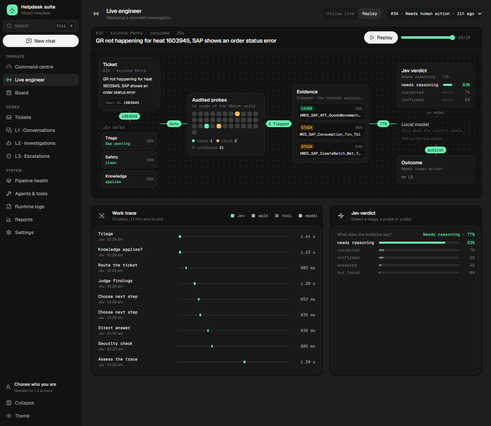

#### Board
Two views of the Hermes Kanban and the tickets:

- **Agent tasks:** in-flight / stuck / superseded / done at a glance. Blocked reviews are split into **stuck (needs a person)** and **superseded by a later review/rework cycle**, which is expected. Each card shows kind and cycle, the proposed outcome and evidence status, the worker and time taken.
- **Ticket lifecycle:** open tickets grouped by support state, with the same panels and cards.

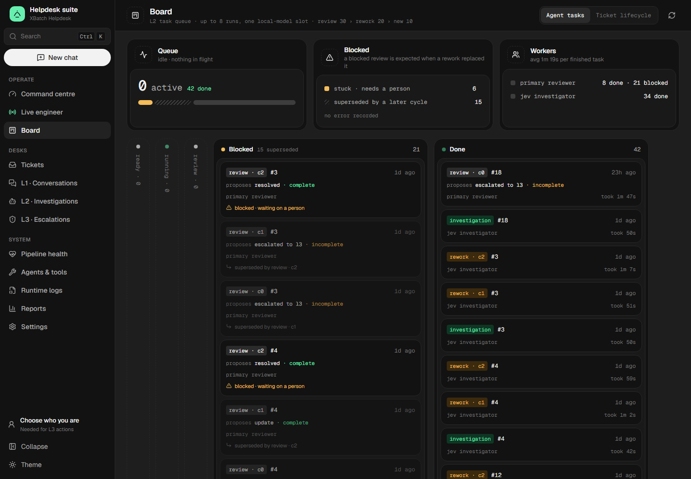

#### Tickets
Every ticket with views and filters. Each ticket shows its **journey** (L1 chat → raised → each L2 attempt → current state), and every step opens its record. Tabs: activity, the chat that raised it, and its L2 investigations. Properties sit on the right.

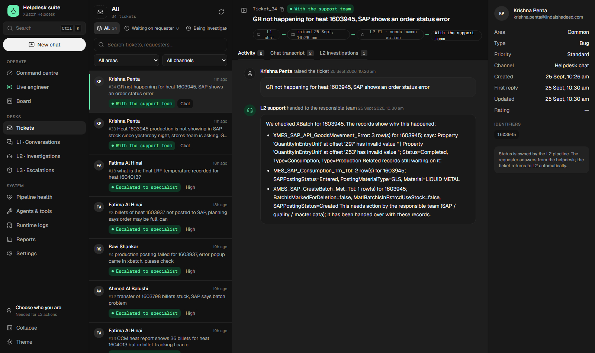

#### L1 · Conversations
A support inbox. The views sit in the main nav (My chats, All, Open, Raised a ticket, Answered by assistant, Marked not helpful, Solved), then the list, the conversation, and a details rail. The rail shows who the requester is, what the chat led to (ticket state, last L2 outcome) and their other chats.

- Your own chats are live and can be continued.
- Everyone else's are read-only.

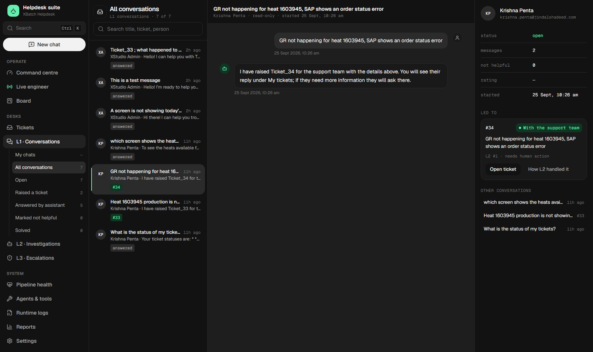

#### L2 · Investigations
Every run, searchable and filterable by outcome. Each run opens on **How it happened** (the same circuit as Live engineer, replayable), **What was told** (problem, findings, the reply, stored Jev decisions) and **Audited reads** (every SQL action with its query).

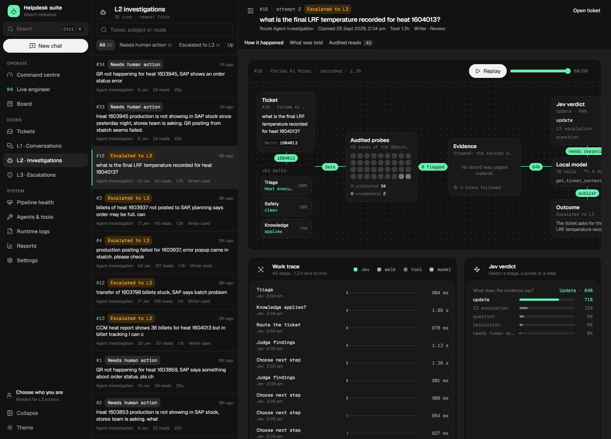

#### L3 · Escalations
Everything L2 handed to people. Pick it up, add internal or requester-visible notes, resolve (optionally closing the ticket), or reopen. Each escalation links to the L2 investigation and the full ticket. Actions are recorded against the acting engineer (choose yourself at the bottom of the nav).

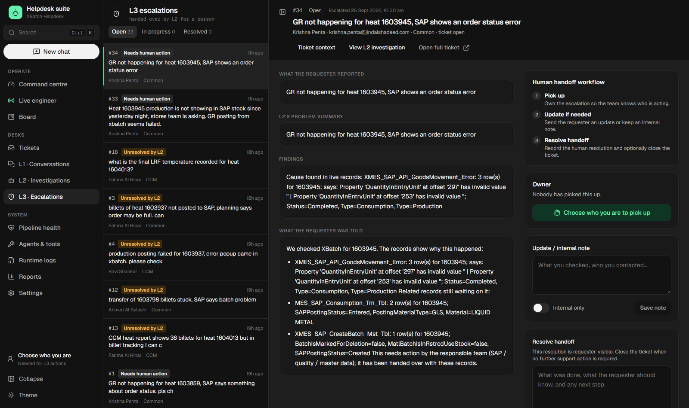

#### Pipeline health
The runtime's own `status` and the performance report, laid out:

- **Runtime:** ready to claim, local-model slots, anomalies.
- **Claims:** time since the last claim, stall detection.
- **Lifecycle invariants:** each must be 0.
- **Outcomes, expected answers met, tool failure rates and causes.**
- **Prompt size vs the spill limit.**
- **The runs that missed their expected outcome.** Each opens its investigation.

Window: 2 h, 6 h, 24 h or 7 d.

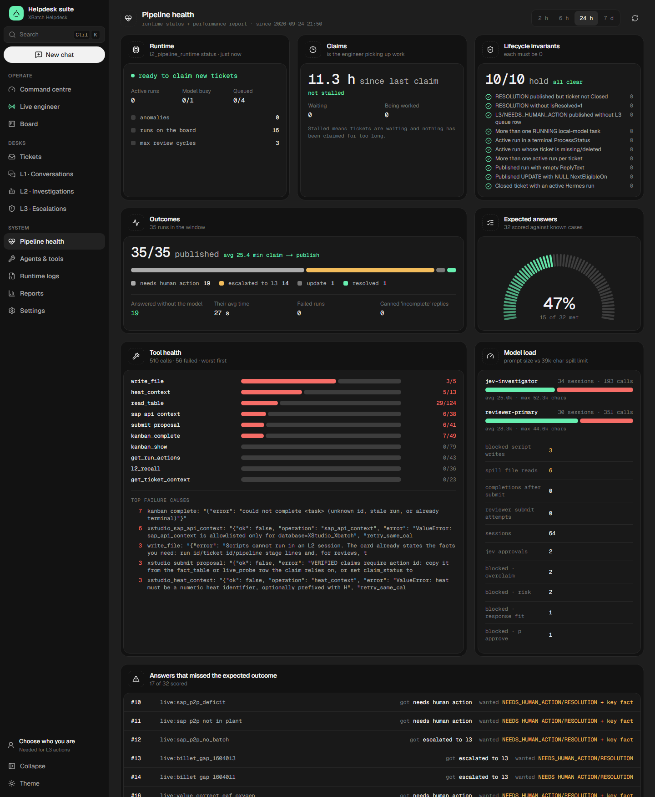

#### Agents & tools
Who does the work (Jev, the worker profiles, the L1 assistant, the local writer). The **tool call graph** shows calls, latency or errors per tool, with the worst tool drawn as the hot path. Also: Jev decisions by kind, what agents may do (permission catalog) and recent audited SQL reads.

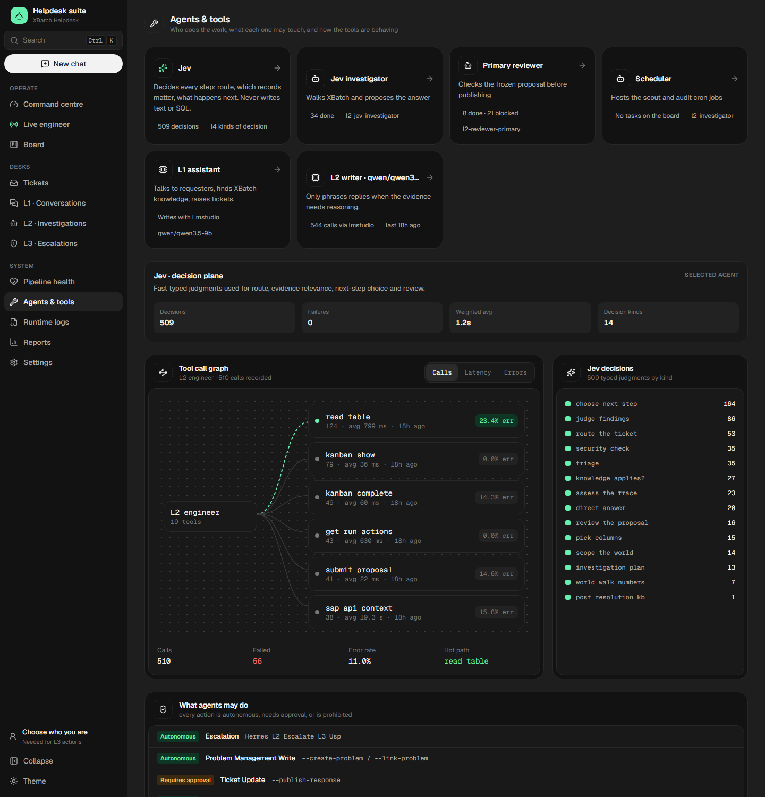

#### Reports
Demand calendar (requests per day, busiest day highlighted). Tickets, conversations, first-reply time, satisfaction and deflection. L2 runtime and compute (Jev, tool and model latency, tokens, GPU/CPU). Breakdowns by state, area and type.

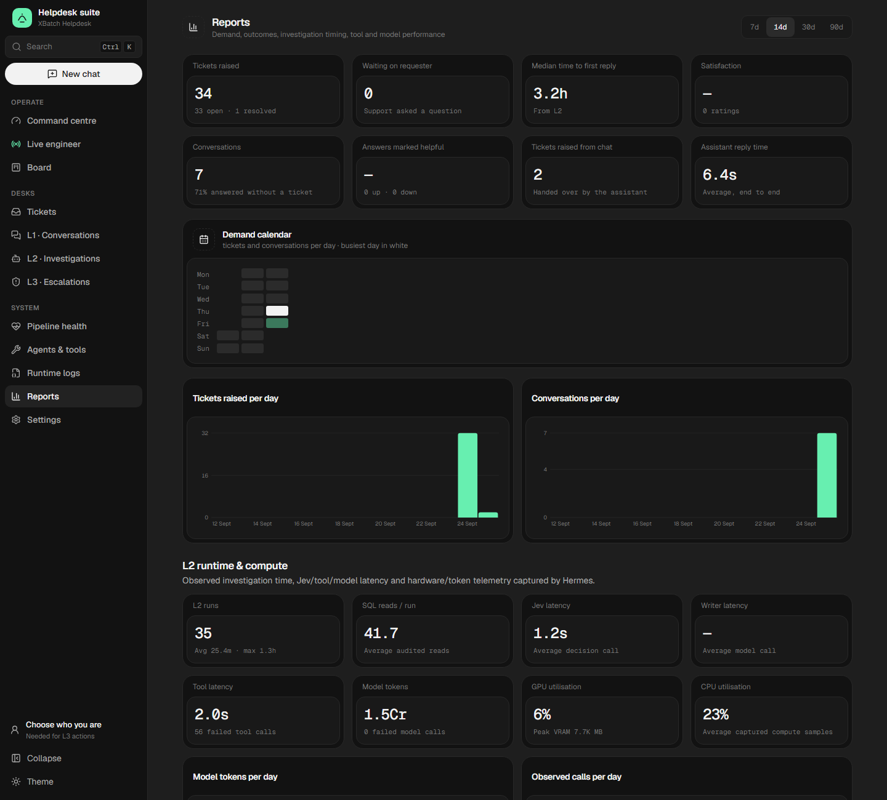

#### Runtime logs and Settings
- **Runtime logs** tails the JSONL call trace and observer events written in WSL.
- **Settings** holds the L1 writer model (OpenAI-compatible: LM Studio, Ollama, OpenAI, Gemini, Groq, OpenRouter; or Anthropic, or the Codex CLI for a ChatGPT plan), GBrain knowledge, the helpdesk name, greeting and **accent colour**, and the embed snippet.

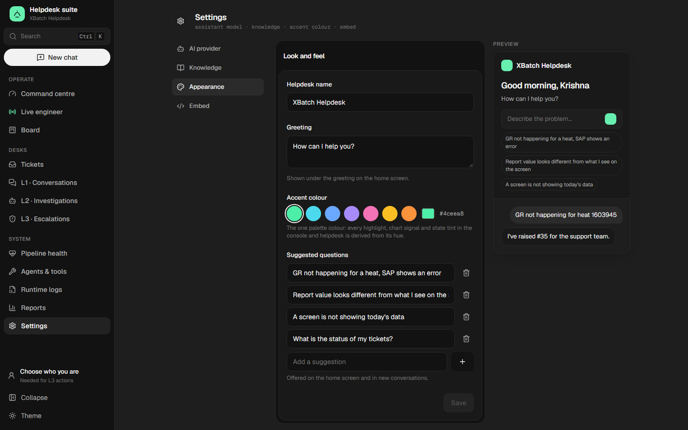

---

## Architecture

Five responsibilities. Each has exactly one owner.

| # | Responsibility | Owner | Owns |
|---|---|---|---|
| 1 | **XStudio Helpdesk** | `XStudio_Helpdesk.dbo.Complaint_Mst_Tbl` | the ticket and its user-visible state |
| 2 | **Chitragupta control** | `Model_Bench/l2_pipeline_runtime.py` + SQL procedures | claim, capacity, queue, retry, recovery, review routing, publication |
| 3 | **Jev: System One** | `Model_Bench/jev/*`, `L1/api` (L1 turn decisions) | typed judgments: route, relevance, execution depth, verdict, primary review. Never writes text or SQL |
| 4 | **Hermes / local model: System Two** | Hermes profiles on LM Studio (Qwen) | composing and focused reasoning, only when Jev says the facts need it |
| 5 | **Evidence and knowledge** | `xstudio_l2` typed tool, audited SQL, GBrain world, governed KB | what is true right now, and what is known |

The L1 layer (`L1/api` + `l1-ui`) is an adapter over the same system, not a sixth responsibility. It owns chat turns, ticket creation from chat, the requester's view of tickets, and the console. It shows L2 read-only and never re-implements the lifecycle.

The normative lifecycle specification is **[`Knowledge/L2_PIPELINE_STATE_MACHINE.md`](Knowledge/L2_PIPELINE_STATE_MACHINE.md)**. The agent operating contract is **[`AGENTS.md`](AGENTS.md)**.

### Where things run

```text
Windows laptop / server                          WSL (Ubuntu)
├─ L1 API  (.NET, :5116)  ──── SQL ────┐         ├─ Hermes gateways (systemd --user)
│    ├─ Jev (TypeSafe API)             │         │    l2-investigator      (hosts cron jobs)
│    ├─ GBrain search ──── wsl.exe ────┼────────►│    l2-jev-investigator  (investigation / rework)
│    ├─ runtime status ─── wsl.exe ────┼────────►│    l2-reviewer-primary  (local review fallback)
│    └─ benchmark report (python)      │         ├─ l2_pipeline_runtime.py, ticket_scout.py (cron, 2 min)
├─ l1-ui   (Next.js, :3417) ── /api/l1/* ─► API  ├─ GBrain (~/.hermes/xstudio-gbrain), Qdrant, mem0
└─ Jev bridge (Windows Python)                   └─ Hermes Kanban (SQLite)
                                       │
            SQL Server  XStudio_Helpdesk / XStudio_Xbatch  (reached over Tailscale)
            LM Studio   on the desktop (Tailscale)  — Qwen, one inference slot
```

---

## The L2 pipeline

### Lifecycle

```text
Complaint_Mst_Tbl
   │  ticket_scout.py: reconcile first, then fill free pipeline slots
   ▼
atomic SQL admission (up to L2_MAX_PIPELINE_WIP = 8 active runs)
   │
   ├─ Jev triage + safety + knowledge applicability
   ├─ world_walk over the generated XBatch world: audited reads, Jev role/step choices
   ├─ fact table ─► Jev direct_answer
   │     ANSWERED / CONFIRMED / CORRECTED / NOT_FOUND ─► fixed reply, published (QWEN_FREE)
   │     NEEDS_REASONING ─► frozen work package, queued for the local model
   ▼
SQL-serialised local-model slot: exactly one RUNNING task
   priority: review 30 > rework 20 > new investigation 10
   ▼
investigator / rework ─► frozen proposal ─► Jev PRIMARY REVIEW
        APPROVE ─► deterministic publish
        REWORK ─► bounded rework (review_cycle ≤ 3)
        L3_ESCALATION ─► L3 queue
        LOCAL_REVIEW ─► local reviewer, only on ambiguity or conflict
```

There is one Kanban board and one lifecycle authority. A local reviewer card is an exception path, not the normal route.

### Execution modes

| Mode | When | Model use |
|---|---|---|
| `QWEN_FREE` | Jev's verdict is supported by the audited fact table (`L3_ESCALATION`, `NEEDS_HUMAN_ACTION`, confirmed / corrected / answered) | none. The harness renders a fixed reply with verified claims |
| `COMPOSE_ONLY` | evidence is sufficient but needs phrasing | small context, normally zero extra reads |
| `FOCUSED_REASONING` | evidence is incomplete | larger bounded budget of focused live reads |

### Invariants

- **Two capacity domains.** Pipeline WIP (default 8 active runs, `L2_MAX_PIPELINE_WIP`) is separate from the one RUNNING local-model slot. The waiting threshold is `L2_MAX_QWEN_WAITING` (default 4). New investigations pause at the threshold; review and rework are still admitted so ongoing runs never starve.
- **Frozen work.** The worker card is stored on the run before admission. A QUEUED run without a Kanban card is valid state.
- **The review loop** uses `review_cycle`, not SQL `AttemptNo`. At most 3 cycles.
- **UPDATE continuations** are capped at 3 per ticket version. The next one escalates to L3.
- **Resolution binding fails closed.** A `RESOLUTION` cannot publish unless the live resolved status is bound (`deploy/helpdesk_workflow_binding.json`: eligible `Enter`, resolved `Closed`, waiting-user AskStatus `Ask`).
- **Recovery has one owner:** `recover_orphan_runs` in the runtime.
- **Jev owns semantics, never mechanics.** SQL safety, workflow binding, WIP, mutation and publication are code-owned.
- **A `RESOLUTION` does not create an approved KB article.** Curation writes a `Candidate`, which is promoted only when a verified resolution on a different ticket reuses it.

### Response types

| Type | Meaning |
|---|---|
| `RESOLUTION` | outcome or fix verified; may close through the bound workflow |
| `UPDATE` | verified progress, not yet resolved |
| `QUESTION` | a specific requester fact is genuinely needed |
| `NEEDS_HUMAN_ACTION` | cause and action known, but executing it is outside L2's authority |
| `L3_ESCALATION` | cause unresolved or beyond L2 |

### The only way agents touch the database

Workers reach SQL **only** through the typed `xstudio_l2` tool (`xstudio-l2-tools` plugin + `Model_Bench/xstudio_l2_tool_bridge.py`). The model never writes SQL or names columns: `xstudio_read_table(table)` lets the harness pick the filter and columns.

| Need | Operation |
|---|---|
| read a table for the ticket's identifiers | `xstudio_read_table` / `probe_table` |
| read a known table or view with validated identifiers | `select` |
| composed read-only SQL | `query` |
| discover objects and definitions | `find_objects`, `get_definition`, `suggest_tables`, `validate_identifiers` |
| allowlisted read procedures | `read_procedure` |
| live ticket row, run audit, findings ledger | `get_ticket_context`, `get_run_actions`, `save_ledger` |

The safety contract is structural:
- raw SQL is read-only, and write, DDL and `EXEC` are rejected;
- procedures need an explicit allowlist;
- identifiers are validated;
- output is bounded, and identical repeated failures are circuit-broken;
- model-driven use of interpreters, database drivers, `sqlcmd` or package installs is blocked by the plugin guard and `approvals.deny`.

Publication and Jev are never worker tools.

### Jev workflows (harness-owned)

| Workflow | Stage | Stored in |
|---|---|---|
| L1 turn decision | answer / ask / ticket, page relevance | L1 chat message `Decision` |
| `TICKET_TRIAGE`, `TICKET_SECURITY`, `GBRAIN_APPLICABILITY` | gates | `JevTriageJson` |
| `WORLD_WALK_ROUTE`, `_ROLE`, `_STEP`, `_COLUMNS` | world walk | trace events |
| `JEV_DIRECT_ANSWER`, `JEV_INVESTIGATION` | verdict / execution depth | `JevInvestigationJson` |
| `PRIMARY_REVIEW` | review of the frozen proposal | `JevReviewJson`, `JevReviewDecision` |
| `TRACE_ASSESSMENT` | trace quality | `JevTraceJson` |
| KB applicability / curation | after verified resolutions | `JevKBCurationJson` |

Every System One call is also written to `Hermes_Agent_Trace_Trn_Tbl` as `EventType = jev_system_one`. There is one run spine and one observability stream, and no separate Jev tables.

---

## Knowledge

| Layer | What it is | Authority |
|---|---|---|
| `Knowledge/*.md`, `manifest.json`, `task-router.md` | canonical domain and runtime reference | Git |
| `Knowledge/process_world.json` → `Knowledge/world/**` | the generated XBatch process world (`build_process_world.py` → `build_world_pages.py`) | Git, generated |
| GBrain source `xstudio-knowledge` | searchable index of the committed world, used by L1 answers and `world_walk` | derived; `sync` reads **committed** files only |
| governed SQL Solution articles | reusable known issues: `Candidate` → `Approved` | SQL |
| ticket / problem history | episodic evidence | SQL |
| mem0 | compact operational heuristics only (never interpreter or driver mechanics) | memory |
| Qdrant | retrieval index | derived |

For a claim about the current ticket, live SQL evidence outranks everything else.

---

## The L1 API

`L1/api` (.NET, `http://localhost:5116`). The browser only calls `/api/l1/**` on the UI, which proxies to the API (SSE included). SQL, Jev, GBrain, model keys and credentials stay server-side, and API keys are encrypted at rest.

| Area | Routes |
|---|---|
| Accounts and config | `GET /api/users`, `/api/users/{id}`, `/api/config` |
| Chat | `GET/POST /api/sessions`, `PATCH/DELETE /api/sessions/{id}`, `GET /api/sessions/{id}/messages`, `POST /api/sessions/{id}/turn` (SSE: `status`, `sources`, `token`, `ticket`, `done`), `POST /api/messages/{id}/feedback` |
| Requester tickets | `GET /api/tickets`, `/api/tickets/{id}`, `POST …/reply`, `…/rating`, `…/follow-up` |
| Console: desk | `GET /api/admin/tickets`, `/tickets/{id}`, `/conversations`, `/conversations/{id}`, `/stats`, `/lookups` |
| Console: settings | `GET /api/admin/settings`, `PUT /settings/{section}`, `POST /ai/models`, `/ai/test`, `/knowledge/search` |
| Operations | `GET /api/ops/overview`, `/runs`, `/runs/{id}`, `/live`, `/board`, `/l3`, `POST /l3/{id}`, `GET /tools`, `/logs` |
| Pipeline health | `GET /api/ops/status` (runtime `status`, WSL), `GET /api/ops/performance?hours=N` (benchmark report). Read-only, cached 20–30 s, one at a time, with timeouts |

---

## Running it

### Prerequisites

- Windows with **WSL (Ubuntu)**, **.NET 10 SDK**, **Node ≥ 20.19**, **Python 3.12+** with `pyodbc` and ODBC Driver 18.
- SQL Server with `XStudio_Helpdesk` and `XStudio_Xbatch`, reachable at the **Tailscale** address (see *Gotchas*).
- LM Studio with the local model (on the desktop, over Tailscale).
- In WSL: Hermes Agent under `~/.hermes`, the three L2 profiles, GBrain at `~/.hermes/xstudio-gbrain`.

### Environment

| Variable | Where | Used by |
|---|---|---|
| `MSSQL_MCP_SERVER`, `MSSQL_MCP_USER`, `MSSQL_MCP_PASSWORD` | Windows user env | L1 API, benchmark, Jev bridge |
| same keys | each WSL profile `~/.hermes/profiles/<p>/.env` | L2 runtime and workers |
| `TYPESAFE_API_KEY` (+ optional `TYPESAFE_DEFAULT_MODEL`, `TYPESAFE_BASE_URL`) | Windows env | Jev |
| `L2_MAX_PIPELINE_WIP` (8), `L2_MAX_QWEN_WAITING` (4), `CHITRAGUPTA_JEV_*` | WSL profile env | runtime tuning |
| `L1_API_URL` (default `http://127.0.0.1:5116`) | UI env | Next.js proxy |

Never commit `.env` files or put credentials in prompts, cards, tickets or traces.

### Start L1 locally

```bash
dotnet run --project L1/api --launch-profile http
npm --prefix l1-ui run dev -- -p 3417
```

Open `http://localhost:3417/admin` (console) and `http://localhost:3417/?user=<XStudio user ID>` (helpdesk). Both are also in `.claude/launch.json` as `l1-api` and `l1-ui`. Embed in XStudio as a page control that loads the URL in an iFrame: `http://<host>:3417/?user={XStudioUserID}`. `public/embed.js` provides a floating launcher.

### Apply an update: one command

`apply-helpdesk-update.ps1` (also on the **RepoPad** desktop macropad):
1. fast-forwards `main` and refuses a dirty tree;
2. runs `npm run check` and `npm run build`;
3. validates the API build;
4. restarts the API;
5. starts the UI if it isn't running.

Nothing restarts if a check fails.

### L2 runtime and SQL

```bash
# SQL first: apply the generated bundle, then the postflight
#   Knowledge/00_Hermes_L2_FULL_INSTALL.sql   (already includes 25_ and 55_ hardening; do not re-apply them)
#   Knowledge/98_pipeline_postflight.sql
# then the Hermes side (copies runtime/plugins/profiles, restarts gateways)
bash Model_Bench/deploy_l2_pipeline_runtime.sh
```

Edit the numbered SQL sources and regenerate the bundle; never hand-edit the bundle. `.gitattributes` forces LF on `*.sh` and `*.sql`, because CRLF broke WSL scripts and install reproducibility. See `Knowledge/deploy-hermes-sql.md`.

---

## Operating it

**Look first:** console → **Pipeline health**, or the same data from the command line:

```bash
python Model_Bench/benchmark_l2_performance.py --hours 2          # the one live-health report; extend it, don't write ad hoc scripts
python3 ~/.hermes/profiles/l2-investigator/scripts/l2_pipeline_runtime.py status   # in WSL, with the profile .env loaded
```

**Validate before deploying** (locally, against the real environment; GitHub Actions is not proof of live correctness):

```bash
bash Model_Bench/validate_l2_pipeline_local.sh            # fast gate
bash Model_Bench/validate_l2_pipeline_local.sh --full     # full live gate
python3 -m unittest -v Model_Bench/test_l2_pipeline_runtime.py
npm --prefix l1-ui run check && npm --prefix l1-ui run build
```

**Restart a worker profile** (WSL): `systemctl --user restart hermes-gateway-<profile>.service`.

### Gotchas that have cost real hours

- **Use the Tailscale SQL address (`100.94.169.57`), not the office LAN address (`10.2.6.204`).** Off the office network the LAN address is unreachable. Every WSL cron tick then fails with `HYT00 Login timeout`, the board looks "idle", and time-since-last-claim keeps climbing. Windows and all three WSL profiles must point at the same Tailscale address.
- **Profile `.env` files are CRLF.** A raw `source` puts `\r` into the server name. Load with `set -a; source <(tr -d '\r' < .env); set +a`.
- **SQL timestamps (`CreatedOn`, `EventOn`) are already IST.** Do not add 5:30. WSL's `date` and cron output filenames are **UTC**, which is not clock drift.
- **Model calls are traced without a duration.** The console estimates model time from the gaps between steps. The gap before a worker session starts is queue wait and is reported separately.
- **pyodbc hides procedure errors behind result sets** until `nextset()`. Drain before commit.
- **GBrain `sync` reads committed git files.** Commit regenerated world pages before syncing.
- **`XMES_Log_Trn_Tbl` is huge** (3.5 GB, PK only). Never `LIKE`-scan it live; use the build-time log index.

---

## Repository map

```text
L1/api/                       .NET L1 API: chat turns (Jev + GBrain + writer), tickets, console ops, pipeline health
l1-ui/                        Next.js app: requester helpdesk (/) and support console (/admin)
  components/ui/viz.tsx         the console's visual kit (panels, charts, gauges)
  components/console/circuit.tsx   the investigation circuit (live + replay)
Model_Bench/
  l2_pipeline_runtime.py      the single deterministic lifecycle state machine
  ticket_scout.py             2-minute reconcile-first claim backstop
  world_walk.py, build_process_world.py, build_world_pages.py   the XBatch world
  jev/, jev_workflow_bridge.py   System One workflows + Windows bridge
  xstudio_l2_tool_bridge.py, xstudio_l2_tools_plugin/   the typed tool surface + guard
  xstudio_l2_orchestrator_plugin/   event trigger into the same reconciler (acceleration only)
  benchmark_l2_performance.py  the live-health report
  validate_l2_pipeline_local.sh, test_l2_pipeline_runtime.py
Knowledge/                    SQL sources + generated bundle, lifecycle spec, world, routing, design docs
deploy/                       workflow binding, profiles, skills, plugins, cron mirror, GBrain schema pack
apply-helpdesk-update.ps1     local apply (validate → restart)
tools/RepoPad/                desktop macropad that runs the apply script
docs/screenshots/             the screenshots in this README
Plans/, Agent_Comms/          history and provenance only: not current instructions
```

---

## Design system

Both surfaces share one visual language (`l1-ui/components/ui/viz.tsx`, tokens in `l1-ui/app/globals.css`):

- **Neutral graphite plus one accent.** The accent is set in Settings → Appearance (default `#4ceea8`). Every highlight, chart signal, "done" state and focus ring is **derived from its hue** with OKLCH relative colour, so changing it recolours everything consistently in light and dark mode.
- **Panel shell:** dashed icon tile, title, one mono line of context, and an inset body. Mono numerals for data.
- **Charts over tables** wherever the data is a composition, distribution, decision or timeline: `SegmentBar`/`Legend`, `TickGauge`, `ProbBars`, `Waterfall`, `HeatCalendar`, the tool call graph. Tables remain only for genuinely tabular records (audited reads).
- Motion only when it carries state (a live stage pulsing, a wire the work is crossing).
- Lint (`@shadcn/lint`) forbids raw colours, inline styles and arbitrary values in app code; primitives live in `components/ui`.

---

## Change discipline

Before changing the ticket pipeline, read `AGENTS.md`, `Knowledge/L2_PIPELINE_STATE_MACHINE.md`, `Model_Bench/l2_pipeline_runtime.py` and its tests. Then:

1. Trace current callers into the runtime. Prefer deleting a duplicate path over adding a coordinator.
2. Keep pipeline capacity, single-slot model admission, frozen proposals, workflow binding, publication and audit safety intact unless a concrete defect requires otherwise.
3. Validate locally and look at live state before deploying.

**Retired, do not revive:** a separate `l2-review` board; `kanban_forward_bridge.py`; independently scheduled review dispatch; pre-created reviewer cards; backlog-`<3` claiming; `AttemptNo` as the review counter; model-named verifier profiles; `--draft-response` / `--approve-draft` choreography; agent-composed Python/pyodbc/sqlcmd transport; separate publisher/reject/repair cron jobs; poll-into-long-lived-chat. Documents under `Plans/` and `Agent_Comms/` may describe these as history.

The repository keeps one current explanation for each mechanism and one implementation authority for each lifecycle transition.
